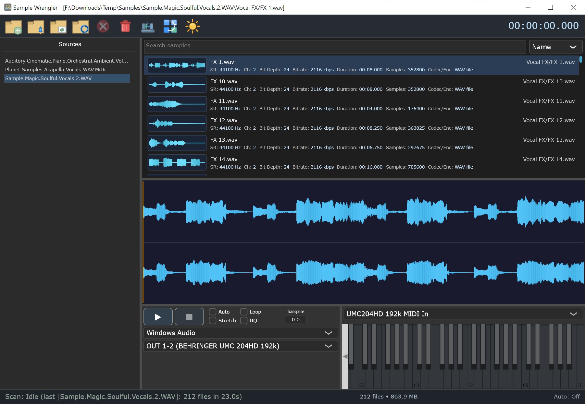

# SampleWrangler

[](LICENSE.txt)
[](https://github.com/thetheosopher/SampleWrangler)
[](https://en.cppreference.com/w/cpp/20)
[](https://juce.com)

A fast Windows desktop audio sample librarian and preview tool built with JUCE, modern C++, and SQLite.

Add source folders, scan them into a searchable catalog, inspect waveform and metadata, and audition files with low-latency ASIO playback, looping, and MIDI-driven pitch preview — all from a single lightweight application.

## Screenshot



The main window shows the source browser, searchable results list, waveform view, and preview controls in a single layout.

---

## Table of Contents

- [Screenshot](#screenshot)
- [Support](#support)
- [Features](#features)
- [Supported Formats](#supported-formats)
- [Build Requirements](#build-requirements)
- [Quick Start](#quick-start)
- [CMake Presets](#cmake-presets)
- [Packaging](#packaging)
- [Running Tests](#running-tests)
- [Runtime Data Storage](#runtime-data-storage)
- [Repository Layout](#repository-layout)
- [Technology Stack](#technology-stack)
- [License](#license)

---

## Support

If you find SampleWrangler useful and want to support continued development, you can buy me a coffee here:

[☕ Buy Me a Coffee](https://buymeacoffee.com/theosopher)

---

## Features

### Library and Catalog

- Local-only SQLite catalog with FTS5 full-text search over file names and paths.
- Source folder management: add, rename, remap, delete, rescan, and reveal in Explorer.
- File identity based on source root + relative path, making source-folder relocation practical.
- Search scopes: whole-library or per-root. File statistics tracked per library, root, or result set.

### Scanning and Metadata Extraction

- Recursive background scanning with cancellation support and transaction-batched DB updates.
- Rich metadata: file size, duration, sample rate, channels, bit depth, bitrate, codec, BPM, key, loop markers, and REX slice count.
- ACID WAV metadata parsing (BPM, root note, beats, loop points).
- Apple Loop AIFF metadata parsing (root note, loop markers).
- REX/RX2 metadata extraction via the bundled REX SDK when available.
- Automatic waveform overview generation during scanning.

### Preview and Audio

- JUCE-based audio output with ASIO support and preference for low-latency buffer sizes.
- Play/stop (spacebar), loop, and autoplay controls.
- Resample-style pitch shifting in semitones.
- Optional time-stretch mode with high-quality stretch via [Rubber Band Library](https://breakfastquay.com/rubberband/).
- Physical MIDI input routing and on-screen keyboard for pitch preview.
- Polyphonic MIDI-triggered preview with preallocated voices and RT-safe audio thread.

### Waveform and Visual Analysis

- Cached peak-overview waveform rendering in results list and main display.
- Scrubbable waveform with playhead and loop overlays.
- Right-click display modes: spectrogram, oscilloscope, and spectrum analyzer.

### Usability

- Dark and light themes.
- Resizable split layout with persisted panel ratios.
- Database maintenance (VACUUM) from the toolbar.
- Drag-and-drop files out of the application to Explorer or other programs.
- Persisted app state: theme, audio device, MIDI input, preview settings, layout, and last selection.

---

## Supported Formats

- `WAV (incl. ACID)`: playback plus duration, sample rate, channels, bit depth, bitrate, codec, BPM, root note, and loop-marker metadata.
- `AIFF / AIF (incl. Apple Loop)`: playback plus duration, sample rate, channels, bit depth, bitrate, codec, root note, and loop-marker metadata.
- `FLAC`: playback with standard JUCE reader metadata.
- `MP3`: playback with standard JUCE reader metadata.
- `REX / RX2`: playback plus sample rate, channels, bit depth, duration, BPM, and slice count.

> **Note:** REX/RX2 support requires the Propellerhead REX SDK DLL at runtime.
> MP3 reading is enabled via `JUCE_USE_MP3AUDIOFORMAT=1`. See the [JUCE MP3 legal disclaimer](https://docs.juce.com/develop/classjuce_1_1MP3AudioFormat.html).

---

## Build Requirements

| Requirement   | Version                                |
| ------------- | -------------------------------------- |
| Windows       | 10+                                    |
| Visual Studio | 2022 with Desktop C++ workload         |
| CMake         | 3.15+                                  |
| Git           | Any recent version                     |

> This project targets **MSVC only**. MinGW is not supported.

---

## Quick Start

Clone the repository with submodules:

```bash
git clone https://github.com/thetheosopher/SampleWrangler.git
cd SampleWrangler
git submodule update --init --recursive
```

Configure and build:

```bash
cmake --preset vs2022-debug
cmake --build --preset vs2022-debug
```

Run the application:

```bash
.\build\vs2022-debug\SampleWrangler_artefacts\Debug\SampleWrangler.exe
```

For a release build:

```bash
cmake --preset vs2022-release
cmake --build --preset vs2022-release
.\build\vs2022-release\SampleWrangler_artefacts\Release\SampleWrangler.exe
```

---

## CMake Presets

| Preset                 | Configuration | Rubber Band HQ Stretch |
| ---------------------- | :-----------: | :--------------------: |
| `vs2022-debug`         |     Debug     |         Enabled        |
| `vs2022-release`       |    Release    |         Enabled        |
| `vs2022-debug-nohq`    |     Debug     |        Disabled        |
| `vs2022-release-nohq`  |    Release    |        Disabled        |

All presets target **x64** with the Visual Studio 17 2022 generator. The MSVC runtime is statically linked (`/MT` / `/MTd`).

Rubber Band Library v4 (GPL) is included as a git submodule in `third_party/rubberband`. If you cloned without `--recursive`, initialize it with:

```bash
git submodule update --init third_party/rubberband
```

Use the `-nohq` presets to build without Rubber Band (granular stretch only).

---

## Packaging

To create both release artifacts:

```bash
cmake --preset vs2022-release
cmake --build --preset vs2022-release-artifacts
```

This produces:

- `build/vs2022-release/packages/SampleWrangler-1.0.0-win64-setup.exe`
- `build/vs2022-release/packages/SampleWrangler-1.0.0-win64-portable.zip`

The installer is built with [Inno Setup 6](https://jrsoftware.org/isinfo.php) and supports per-user or per-machine installs, Add/Remove Programs registration, and optional Start Menu/Desktop shortcuts.

If Inno Setup 6 is not auto-detected, set `SW_INNO_SETUP_COMPILER` to the full path of `ISCC.exe` when configuring. If you only want the portable ZIP, build:

```bash
cmake --preset vs2022-release
cmake --build --preset vs2022-release-portable-zip
```

Release artifacts are statically linked where possible. The only unavoidable external runtime dependency currently shipped beside the executable is the REX SDK DLL when REX support is enabled.

---

## Running Tests

The repository includes lightweight native tests for non-audio modules:

| Test Target                           | Coverage                          |
| ------------------------------------- | --------------------------------- |
| `SampleWranglerCatalogDbTests`        | SQLite catalog queries and schema |
| `SampleWranglerScannerAppleLoopTests` | Apple Loop AIFF metadata parsing  |
| `SampleWranglerWaveformPeakTests`     | Waveform peak generation          |

After building, run with CTest:

```bash
ctest --test-dir build/vs2022-debug -C Debug
```

---

## Runtime Data Storage

SampleWrangler stores data in the Windows Local AppData directory:

- `Catalog database`: `%LOCALAPPDATA%\SampleWrangler\catalog.db`
- `Waveform cache`: `%LOCALAPPDATA%\SampleWrangler\wave_cache.db`

The waveform cache is stored as SQLite BLOB data.

---

## Repository Layout

```text
Source/
  App/            Application entry point and top-level UI wiring
  UI/             Browser, results, waveform, and preview panels
  Catalog/        SQLite catalog, schema, models, and waveform cache
  Pipeline/       Job queue, scanner, analyzer, waveform cache, REX support
  Audio/          Audio engine, voice manager, and MIDI input routing
  Util/           Path helpers, hashing, and logging
Tests/            Native tests for catalog, scanner, and waveform peaks
third_party/
  sqlite/         Vendored SQLite amalgamation
  rubberband/     Rubber Band Library v4 (git submodule, GPL)
JUCE/             JUCE framework (git submodule)
REXSDK_Win_1.9.2/ REX SDK integration files
cmake/            Inno Setup packaging scripts and release helpers
docs/             Developer setup and archive notes
```

---

## Technology Stack

- **Language:** C++20
- **Framework:** [JUCE](https://juce.com)
- **Database:** [SQLite](https://sqlite.org/) with FTS5
- **Stretch:** [Rubber Band Library](https://breakfastquay.com/rubberband/) v4 (optional, GPL)
- **Build:** CMake 3.15+ / MSVC

---

## License

This project is licensed under the [MIT License](LICENSE.txt).

> **Third-party licenses:** JUCE is dual-licensed (GPLv3 / commercial). Rubber Band Library is GPL unless commercially licensed. See each submodule for details.

- CMake presets for Visual Studio 2022
- Rubber Band v4 for optional high-quality stretch
- Propellerhead REX SDK integration for REX and RX2 support

## Licensing And Third-Party Notes

SampleWrangler itself is distributed under the MIT License. See [LICENSE.txt](LICENSE.txt).

Important third-party considerations:

- JUCE is included as a submodule and remains subject to JUCE's own license terms.
- MP3 support is enabled through `JUCE_USE_MP3AUDIOFORMAT=1`; JUCE documents a legal disclaimer for MP3 support that you should review before redistribution.
- Rubber Band v4 is included as a submodule for high-quality stretch. Rubber Band is GPL unless you have a commercial license.
- REX and RX2 support depends on the Propellerhead REX SDK and its license terms.

## Current Status

This repository already contains a functioning Windows-focused MVP with scanning, search, waveform caching, preview playback, MIDI preview routing, ASIO-capable device management, and packaging support. The codebase is organized to keep UI, database, worker-thread processing, and the real-time audio path separated.

For more setup detail, see [docs/DEVSETUP.md](docs/DEVSETUP.md).
